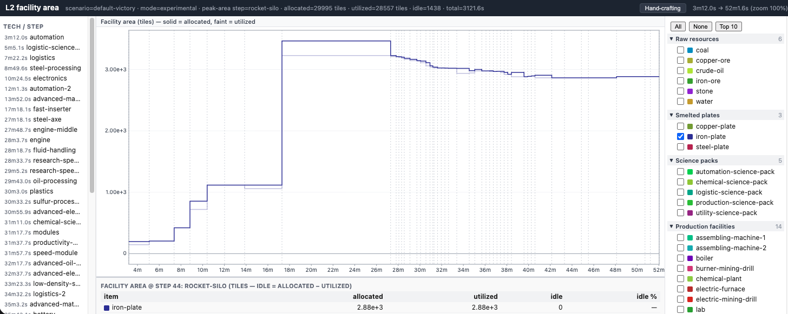
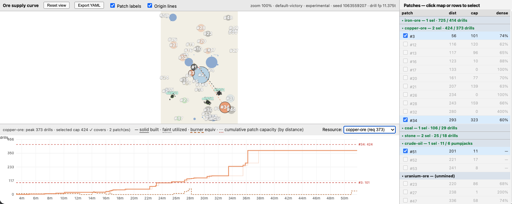

# L2 rates — post-processing (`fplan rates post`)

`rates post` is the **L2 → L3 bridge**: it refines a solved `rates.yaml` into the
input the layout stage places. Its job is **block preparation** — turning the
solve's per-step, sometimes time-varying schedule into the **static, placeable
blocks** L3 needs. Flattening (smoothing per-item rates) is one operation of
several; the others — combining repurpose chains and splitting by belt lanes —
are planned. This doc is organized so the **stable** framing and operations sit
up front and the parts that **track the still-fluid L3 contract** are fenced at
the end, marked *provisional*.

## Contents

- [Provisional by design](#provisional-by-design)
- [What post does — the block-prep frame](#what-post-does--the-block-prep-frame)
- [Inputs: the solve's outputs](#inputs-the-solves-outputs)
  - [The facility-area view](#the-facility-area-view)
  - [The supply-curve view & patch selection](#the-supply-curve-view--patch-selection)
- [Flattening (the current operation)](#flattening-the-current-operation)
  - [The causal tube](#the-causal-tube)
  - [Three flattening rules (`--method`)](#three-flattening-rules---method)
  - [Area conservation](#area-conservation)
  - [The unmet-input report](#the-unmet-input-report)
  - [The flatten-diff view](#the-flatten-diff-view)
- [Planned operations](#planned-operations)
- [Outputs & reports](#outputs--reports)
  - [The base-area split report](#the-base-area-split-report)
- [Provisional — tracks L3 (in flux)](#provisional--tracks-l3-in-flux)

## Provisional by design

`rates post` writes `runs/<run>/rates-post.yaml` — the temporary **L3 input** —
and is still under development. Two things are intentionally temporary:

1. **The output is the temporary L3 input.** L3's preferred input format isn't
   decided yet; we're still characterizing the L2→L3 data.
2. **The output *schema* is temporary too.** It mirrors the `rates.yaml` schema
   (same step/item shape) with the post-processed production characteristics
   substituted in, plus a sibling `post:` metadata block (tagged
   `schema: provisional-rates-mirror`, the marker `rates viz` auto-detects). This
   is a placeholder chosen because it's the format we already have.

Don't build anything downstream that assumes this schema is stable.

## What post does — the block-prep frame

L3 places **blocks** — groups of machines committed to a job. The solve's output
isn't yet block-shaped: a machine's job can change over time, rates swing
step-to-step, and a block's throughput may exceed what one belt lane carries.
Post reshapes the solve result toward static, placeable blocks through a sequence
of operations:

| Operation | What it does | Status |
|---|---|---|
| **flatten** | smooth each item's per-step rate to the fewest constant-rate segments that still meet every deadline | **current** |
| **combine** | merge a repurpose chain into one static block where inputs/outputs line up (e.g. science-pack assemblers → rocket-part-input assemblers once research ends) | planned |
| **lane-split / combine** | shape a block to belt-lane throughput — split a block whose I/O exceeds one lane, keep one block when a low rate later grows into a full lane | planned |
| **static-ification** | the net effect: hand L3 blocks whose job and size don't change in time | the goal |

Flattening's role is **shrinking** — note that the solve increasingly flattens
rates itself, via repurpose penalties, so some rates already arrive smooth before
post runs. The block-shaping operations (combine, lane-split) are where post's
value is moving.

## Inputs: the solve's outputs

Post consumes the solve's `rates.yaml` — the per-step schedule, the
[assignment](L2-rates-solve.md) buckets, and the `spatial:` block (deployed
footprints and caps). Two **spatial visualizations** read that same output and
are the lenses you iterate the post algorithm with: the facility-area view (how
much area each item reserves, and how static it is) and the supply-curve view
(which ore patches feed it). Both are written by `rates viz` and render **without
a Factorio install** — they read the emitted data, never the game model.

### The facility-area view



*Facility area per item: solid = allocated (committed machines × footprint), faint = utilized (running machines × footprint); the gap is built-but-not-running area L3 must place. The table breaks the selected step down per item.*

Per item over time, two curves of footprint × machine-count: **allocated**
(solid — machines *committed* to producing that item: the assignment buckets
drills@ore / furnaces@product / assemblers@recipe, plus pooled machines running
its recipe) and **utilized** (faint — machines *actually running* its recipe that
step). The gap `idle = allocated − utilized ≥ 0` is **built-but-not-running**
area — placed facilities L3 must still reserve even when momentarily idle. For a
repurpose-penalized bucket the gap is real; for a pooled item the two lines
coincide. This is the spatial L2→L3 handoff lens — the more an item's allocated
band sits flat and fully utilized, the closer it already is to a static block.

`rates viz` writes it as `runs/<run>/viz/<stem>-area.html` by default (`--no-area`
to skip). It reuses the timeline's template, legend, nav, and zoom (one overlay
panel, solid + faint), and the bottom table breaks the selected step (the
peak-area step by default) into each visible item's allocated / utilized / idle
area.

**Interactions.** The view reuses the timeline's controls — the right-bar legend
(check an item to plot its allocated + utilized bands; **All** / **None** /
**Top 10**, here ranked by area; click a group header to collapse it), chart
hover / zoom / pan, and the **Hand-crafting** side panel — all documented in
[solve § 6.3](L2-rates-solve.md#63-interactions). Checking items refreshes the
bottom table; **clicking an item there** pops a per-facility breakdown — facility
· *assigned* (built) · *running* · area tiles — for the selected step (the
peak-area step until you select another). For example, `coal` at the
`electronics` step → some electric-mining-drills (mostly assigned-but-idle) plus
fully-utilized burner-mining-drills.

**What it reads — emitted, not recomputed.** Because the view can't load the
model, the solve emits the two reference maps it needs, single-sourced where they
are authoritative (the same no-drift discipline as the `spatial:` block):

- **`facilities: {building: {footprint, base_speed}}`** — the **deployed**
  footprint (infrastructure included) and base crafting speed of every building
  the solve used.
- **`recipe_outputs: {recipe: item}`** — each recipe's principal output
  (`outputs[0]`), so a running or committed machine attributes its area to the
  item it makes (pseudo research / launch / power rows carry no item and are
  omitted).

The view computes, per step:

```
allocated[item] = Σ_penalized-buckets  max(count_start, count_end) · footprint
                + Σ_pooled-activity     machines · footprint
utilized[item]  = Σ_activity            machines · footprint
machines        = recipe_sec_used / (base_speed · duration)
```

Allocated uses `max(count_start, count_end)` — the most machines on the ground at
either boundary, i.e. what L3 must place — so `idle ≥ 0` falls out. Productive
labs and `+`-joined pseudo rows carry no single-building footprint and are
omitted; hand-craft (`character`) area is omitted from both the view and the
[base-area split](#the-base-area-split-report) so the two stay consistent.

### The supply-curve view & patch selection



*The supply-curve view: the patch map (left), the per-resource patch table (right), and miner demand vs the distance-stacked capacity of the selected patches (chart).*

L2 is **geometry-blind**: it pools all patches of a resource into one tile budget
and caps drills at `tile_pool / footprint`, so its `drill@<ore>` lock is an
*ore*-lock, not a *patch*-lock. Which patches actually carry those drills — a few
large ones far away, or many small ones nearby — is a fixed-charge trade no single
rule settles. The supply-curve view lets you make that call by eye and feed it
back into the next solve. Three linked regions:

- **Map** — every patch at its real centroid (ore + oil clusters), water and oil
  as context, clickable to select/deselect, with origin lines to spawn.
- **Right pane** — a grouped table (group = resource, with the solve's peak miner
  demand and a selected-capacity sufficiency check; rows = patches with capacity,
  distance, density).
- **Chart** (one resource via a dropdown) — miner count vs. time (the timeline
  axis): solid = **built** miners, faint = **utilized**, brown dashed =
  **burner-drill equivalents**, red dashed horizontals = **cumulative capacity of
  the selected patches, stacked by distance**. When demand rises above the *k*-th
  horizontal, the *k* closest selected patches no longer suffice.

`rates viz` writes `runs/<run>/viz/<stem>-supply-curve.html` (needs the run's
bound map; skipped with a note if unavailable; `--no-supply-curve` to suppress).
Like the area view it is a **pure consumer** of `rates.yaml` + the map — demand
comes from the solve output (`mining_assignment`, `capacity`, `burner_mining`) and
the tiles→drills footprint from the `spatial:` block, so the lines match the caps
the solve enforced. A `rates.yaml` predating the `spatial:` block renders with
patch capacities blank and a re-solve note.

**Interactions.** Choose the charted resource from the **Resource** dropdown.
**Click a patch on the map — or its row in the table — to select/deselect it**;
the selected set drives the distance-stacked capacity horizontals and the export.
Collapse a resource group via its table header; toggle the patch labels and the
spawn-origin lines with the checkboxes; **scroll / drag** to zoom and pan the map,
or **Reset view** to recenter. **Export YAML** downloads the current selection as
the patch-selection file below.

**The patch-selection file (the contract).** *Export YAML* downloads the current
selection, computed client-side, carrying *resolved totals* (not just patch ids)
so it's self-contained:

```yaml
seed: 1063559207
scenario: default-victory
drill_footprint: 11.375
resources:
  copper-ore:
    unit: drills
    patches: [0, 11]      # patch ids (informational)
    total_tiles: 4828     # sum of selected patches' tiles  <- L2 reads this
    capacity: 424.5       # total_tiles / footprint (informational)
    peak_demand: 400.0    # from the solve (reference)
  crude-oil:
    unit: pumpjacks
    patches: [50]
    spots: 11             # sum of selected clusters' spots  <- L2 reads this
    capacity: 11.0
    peak_demand: 4.8
```

L2 reads only `total_tiles` (drills) / `spots` (pumpjacks); a resource omitted
keeps its **full** map availability. Bind it and re-solve:

```bash
.venv/bin/fplan rates add-selection my-run my-run_patch-selection.yaml
.venv/bin/fplan rates solve my-run
```

`add-selection` records it under the manifest's `inputs:` (content-hashed); a
one-off `rates solve --patch-selection PATH` overrides without touching the
manifest (see [`rates add-selection`](usage.md#rates-add-selection)). The override
needs **no new LP constraint** — it reuses the existing tile-pool path
(`apply_patch_selection` in `fplan.l2.instance`): drill resources replace the
resource's `tile_pool` with `total_tiles`; crude-oil replaces `oil_spot_count`
with `spots`. The file is **untrusted**: a non-mapping file is a clean error, a
single malformed per-resource entry is skipped with a warning rather than
aborting the solve.

This view is the **human-in-the-loop precursor** to L3's facility-location: it
shows the trade and exports a selection, but doesn't *solve* the min-cost
selection (that's L3's job). Distance is spawn-relative; the cost that ultimately
matters is patch→consumer, which depends on placement — the chicken-and-egg that
puts selection inside the L3 loop.

## Flattening (the current operation)

Each change in an item's production rate is a point where the player must walk
back to the assemblers and re-allocate machines — real player-time that a WR TAS
minimizes. L2 emits step-*averaged* rates that can swing wildly between adjacent
steps; many swings are *unforced* (the item was merely building surplus) and can
be flattened away. The headline output is, per item, **#revisits** — the number
of distinct constant-rate segments the schedule collapses to (shown in the viz
legend as `↻N`). Flattening changes neither the solve nor `t_FINAL`; it reshapes
production in time and reports where smoothing is — and isn't — possible.

### The causal tube

"Flatten the curve" is *wrong* read as "make it globally flat": Factorio cannot
produce ahead of causality (you can't build blue-science assemblers before the
tech, the machines, or the inputs exist). The original solve already encodes all
that, so its running-total production is a hard **upper bound** — a flattened
schedule may never produce *more by time t* than the solver proved feasible. For
item *I*, with `P[k]` the original running-total by boundary `k` and `inv[k]` the
authoritative inventory there, the flattened curve must live inside the **tube**:

```
R[k] := P[k] − inv[k]   ≤   P'[k]   ≤   P[k] =: P_orig[k]
P'[0] = 0,   P'[N] = P[N],   P' monotone nondecreasing
```

- **lower bound `R[k]`** — running-total requirement (demand − initial
  inventory). Touching it means inventory hits 0; staying above it never stocks
  out.
- **upper bound `P_orig[k]`** — never produce earlier than the solver did, so
  unlocks, capacity ramp, and input availability are respected.

Where the original ran just-in-time the tube is **pinched** (no flattening
possible); where it carried surplus the tube **opens**. Both bounds are
piecewise-linear with breakpoints only at step boundaries, so the boundary
constraint is **exact**.

### Three flattening rules (`--method`)

- **`chord`** (default) — straight chords between consecutive surplus-zero
  deadlines, *ignoring the tube*. Fewest revisits (the headline metric), but a
  chord can dip below `R` (self-stockout) or rise above `P_orig` (impossible
  front-loading); both are counted and surfaced in the unmet-input report.
- **`tube`** — the Euclidean **taut string** through `[R, P_orig]`. The smoothest
  schedule that neither stocks out nor front-loads past causality (zero
  self-stockouts by construction), computed exactly as a DAG shortest path over
  the corridor corners.
- **`mrp`** — cross-dependency flattening: smoothing starts at science (exogenous
  research draw) and propagates *backward* through the recipe graph as a Jacobi
  fixpoint, so intermediates get *fewer* revisits (their demand is now smooth).
  Per level it uses the chord flattener, so it's a low-revisit **stage-1** that
  can still self-stock-out.

### Area conservation

Every method anchors each item's final running-total to the **original total
production `P[n]`**, so the area under the rate curve is conserved per item —
flattening only *redistributes* production in time, never changes how much is
made. This is a correctness invariant, not tidiness: a plan whose totals match the
original is **adaptable** (a slight real-world adjustment from working); a plan
whose area drifts is no longer making the right amount of anything.

### The unmet-input report

The signal is whether the flattened plan ever falls behind the demand it must
serve — measured as a **running total**, not an instantaneous rate, so buffers
built earlier are credited. For each input item and boundary `b`, compare
**required** (`R[b] = P_raw[b] − inv[b]`, how much must have been created by then)
against **made** (the flattened plan's running-total by `b`); a shortfall means
inventory would have gone negative. `tube` reports zero by construction; `chord`
and `mrp` report where their coarser schedules fall behind. These shortfalls are
the **payload, not a bug** — they mark where smoothing is genuinely impossible
(accept a revisit or pre-build a buffer), resolving them is a follow-up / L3
concern. The report needs the model (the recipe→ingredient map), which is why
`rates post` requires a configured `data_dir` (unlike model-optional `rates viz`).

### The flatten-diff view

> 📷 **Screenshot needed** — `docs/images/05_l2_flatten_diff.png`: the diff view
> from `rates viz --from rates-post.yaml` — faint original vs solid flattened
> production for an item, with the unmet-input table below and the `↻N` revisit
> counts in the legend.

`rates post` auto-generates a diff viz (`--no-viz` to skip); `rates viz --from
rates-post.yaml` regenerates it on demand. It's a **pure renderer** — it reads the
flattened series and the persisted `post:` diagnostics plus the original series
from the referenced source `rates.yaml` (no re-flattening; model loaded only
best-effort), so it works without Factorio. It reuses the timeline template with a
single overlay panel (faint = original, solid = flattened) and swaps the
step-detail table for the unmet-input table; the legend annotates each item with
its `↻N` revisit count.

**Scope (v1).** The unmet check compares against the **raw** solution's
running-total requirement (a fully self-consistent version would compare against
*flattened* consumption); the deficit check is one-shot (the deficits are the
payload, not something to solve away); fuel draws aren't yet in the check;
multi-output recipes use `outputs[0]` as the flatten principal; revisits are
counted on continuous rate changes (integer-machine quantizing is a planned
refinement).

## Planned operations

These move post from "smooth the rates" toward "hand L3 static blocks." Both are
**planned** — the framing is settled, the algorithms are not.

- **Combine repurpose chains → static blocks.** A machine that crafts science
  packs early and rocket-part inputs late is, physically, *one* machine doing
  sequential jobs. Recognizing that the science→rocket-parts transition is a clean
  repurpose lets post describe it as a single **static** block L3 places once
  (with a known job change) rather than two dynamic blocks. This collapses the
  number of distinct blocks L3 must place and makes them static — directly easier
  to solve.
- **Split / combine by I/O lanes.** A block's inputs and outputs ride belt lanes
  (~14 items/s each). A block producing 20/s needs two output lanes and may split
  into two blocks; a block at 7/s that later grows to 14/s stays a single lane,
  one block. Lane-aware shaping turns the solve's continuous rates into
  belt-realizable block geometry for L3.

## Outputs & reports

`rates post` writes `runs/<run>/rates-post.yaml` (the provisional L3 input — same
step/item schema as `rates.yaml` with the flattened production substituted in,
plus the `post:` block recording settings, source, summary, and diagnostics) and
adds a matching `post:` block to the manifest. Consumption and inventory
(`count_start` / `count_end`) pass through from the solve unchanged; only
production (`production_rate_per_s` / `produced`) is rewritten.

### The base-area split report

Alongside the flatten summary, `post` echoes a console **base-area split** — the
spatial companion to #revisits — dividing each step's base area (tiles) into:

- **penalized** — machines an assignment block committed to one job (statically
  placeable);
- **flexible** — the remainder on a *repurposable* kind (`assembling-machine`,
  `furnace`, `mining-drill`) L3 may still pool step-to-step;
- **static** — the remainder on a fixed kind (boilers, labs, …): already a block.

The **penalized fraction is the data-driven dial** for how static the base is:
nearer 100% → easier L3 placement, traded against `t_FINAL` (committing more
machines costs player-time to repurpose). It reads the emitted `facilities:`
footprints and the model's building `kind` (`compute_area_split` /
`format_area_split` in `fplan.l2.flatten`); a `rates.yaml` predating the
`facilities:` block prints a one-line note — re-solve to populate it.

## Provisional — tracks L3 (in flux)

Everything in this section depends on the **still-undecided L3 contract** and will
change as L3 firms up. Treat it as the seam where this doc churns.

- **The `rates-post.yaml` schema is a placeholder** (`provisional-rates-mirror`),
  chosen only because it's the format we already have; L3's real input format is
  undecided.
- **The block format** — how a combined/lane-split block is represented for L3 —
  is not yet defined; the [planned operations](#planned-operations) describe
  intent, not an emitted schema.
- **The lane constant (~14 items/s)** and how lane-splitting interacts with belt
  tiers are not yet pinned to a single source of truth.
- **Open question:** whether per-item #revisits should feed back into L2's
  player-time budget as a cost term (making the solve prefer smooth trajectories)
  or stay a pure report. This leans report-first — but the metric this tool
  produces is exactly what such a cost term would need.
